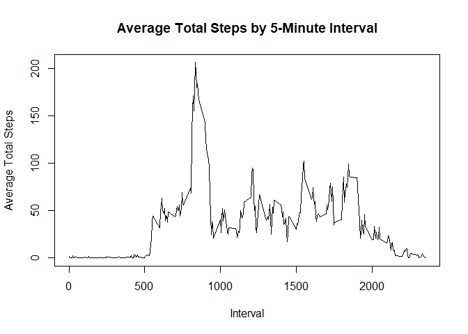
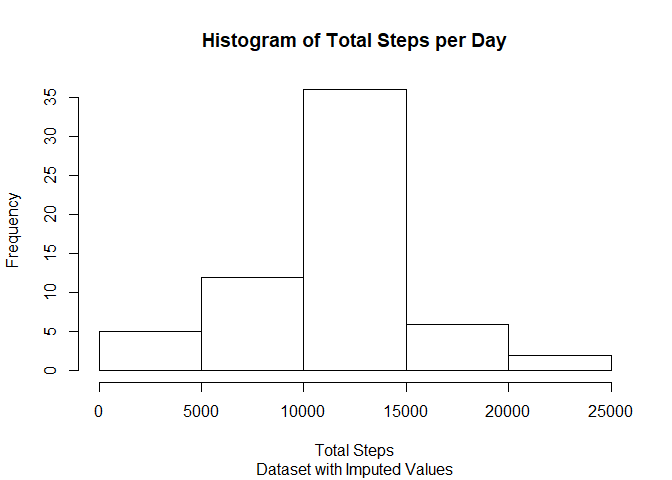
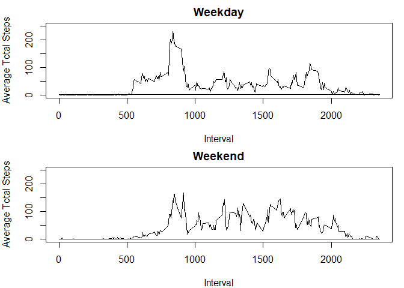

## Part 1
### Reading the data

```r
unzip("activity.zip")
activitydata <- read.csv("activity.csv")
```

## Part 2
### Calculating total steps per day

```r
totalsteps <- with(activitydata, tapply(steps, date, sum, na.rm = TRUE))
```

### Generating a histogram of total steps per day

```r
hist(totalsteps, xlab = "Total Steps", main = "Histogram of Total Steps per Day")
```

<!-- -->

### Calculating mean and median of total steps per day

```r
meantotalsteps <- mean(totalsteps, na.rm = TRUE)
paste("Mean", meantotalsteps, sep = ": ")
```

```
## [1] "Mean: 9354.22950819672"
```

```r
mediantotalsteps <- median(totalsteps, na.rm = TRUE)
paste("Meadian", mediantotalsteps, sep = ": ")
```

```
## [1] "Meadian: 10395"
```

## Part 3
### Time series plot of average total number of steps by 5-minute intervals

```r
mean_total_steps_by_interval <- with(activitydata, tapply(steps, interval, mean, na.rm = TRUE))
mean_total_steps_by_interval <- as.data.frame(as.table(mean_total_steps_by_interval))
colnames(mean_total_steps_by_interval) <- c("Interval", "Average_Total_Steps")
with(mean_total_steps_by_interval, plot(as.numeric(as.character(Interval)), Average_Total_Steps, type = "l", xlab = "Interval", ylab = "Average Total Steps", main = "Average Total Steps by 5-Minute Interval"))
```

<!-- -->

### Determining the 5-minute interval with, on average, the maximum total number of steps

```r
max_steps_interval <- subset(mean_total_steps_by_interval, Average_Total_Steps == max(mean_total_steps_by_interval$Average_Total_Steps))
max_steps_interval[1,]
```

```
##     Interval Average_Total_Steps
## 104      835            206.1698
```

## Part 4
### Calculating the total number of missing values in the dataset

```r
number_of_rows_with_NAs <- sum(!complete.cases(activitydata))
number_of_rows_with_NAs
```

```
## [1] 2304
```

### Strategy for filling in missing values
Missing values will be imputed by calculating the average steps for that interval across the days for which the value is not missing. 

```r
mean_total_steps_by_interval2 <- mean_total_steps_by_interval[,2]
activitydata_with_means <- cbind(activitydata, mean_total_steps_by_interval2)
for(i in 1:length(activitydata_with_means$steps))
    if(is.na(activitydata_with_means$steps[[i]])) {
    activitydata_with_means$steps[[i]] <- activitydata_with_means$mean_total_steps_by_interval2[[i]]
    } else {
        next
    }
```

### Creating a new dataset with the missing data filled in

```r
activitydata_with_means <- activitydata_with_means[,1:3]
```

### Generating a histogram of total steps per day after imputing missing values

```r
totalsteps1 <- with(activitydata_with_means, tapply(steps, date, sum, na.rm = TRUE))
hist(totalsteps1, xlab = "Total Steps", main = "Histogram of Total Steps per Day", sub = "Dataset with Imputed Values")
```

<!-- -->

### Calculating mean and median of total steps per day after imputing missing values

```r
meantotalsteps1 <- mean(totalsteps1)
paste("Mean", meantotalsteps1, sep = ": ")
```

```
## [1] "Mean: 10766.1886792453"
```

```r
mediantotalsteps1 <- median(totalsteps1)
paste("Meadian", mediantotalsteps1, sep = ": ")
```

```
## [1] "Meadian: 10766.1886792453"
```

### Calculating the difference in mean and median of dataset with and without imputed values

```r
diff_in_mean <- abs(meantotalsteps1 - meantotalsteps)
paste("Difference in Mean", diff_in_mean, sep = ": ")
```

```
## [1] "Difference in Mean: 1411.95917104856"
```

```r
diff_in_median <- abs(mediantotalsteps1 - mediantotalsteps)
paste("Difference in Meadian", diff_in_median, sep = ": ")
```

```
## [1] "Difference in Meadian: 371.188679245282"
```

## Part 5
### Coding by “weekday” and “weekend”

```r
activitydata_with_means$day <- weekdays(as.Date(as.character(activitydata_with_means$date), "%Y-%m-%d"))
activitydata_with_means$type_of_day <- vector(length = length(activitydata_with_means$day))
    for(i in 1:length(activitydata_with_means$day)){
        if(activitydata_with_means$day[[i]] == "Saturday") {
            activitydata_with_means$type_of_day[[i]] <- "Weekend"
        } else if(activitydata_with_means$day[[i]] == "Sunday") {
            activitydata_with_means$type_of_day[[i]] <- "Weekend"
        } else {
            activitydata_with_means$type_of_day[[i]] <- "Weekday"
        }
    }
activitydata_with_means$type_of_day <- as.factor(activitydata_with_means$type_of_day)
```

### Creating a panel plot containing a time series plot of the 5-minute interval and the average number of steps taken, averaged across all weekday days or weekend days.

```r
par(mfrow = c(2,1), mar = c(4,4,2,1))
activitydata_with_means_split <- split.data.frame(activitydata_with_means, activitydata_with_means$type_of_day)

activitydata_with_means_weekday <- activitydata_with_means_split$Weekday
mean_total_steps_by_interval_weekday <- with(activitydata_with_means_weekday, tapply(steps, interval, mean))
mean_total_steps_by_interval_weekday <- as.data.frame(as.table(mean_total_steps_by_interval_weekday))
colnames(mean_total_steps_by_interval_weekday) <- c("Interval", "Average_Total_Steps")
mean_total_steps_by_interval_weekday <- cbind(activitydata_with_means_weekday, mean_total_steps_by_interval_weekday)
with(mean_total_steps_by_interval_weekday, plot(as.numeric(as.character(Interval)), Average_Total_Steps, type = "l", xlab = "Interval", ylab = "Average Total Steps", main = "Weekday", ylim = c(0,250)))

activitydata_with_means_weekend <- activitydata_with_means_split$Weekend
mean_total_steps_by_interval_weekend <- with(activitydata_with_means_weekend, tapply(steps, interval, mean))
mean_total_steps_by_interval_weekend <- as.data.frame(as.table(mean_total_steps_by_interval_weekend))
colnames(mean_total_steps_by_interval_weekend) <- c("Interval", "Average_Total_Steps")
mean_total_steps_by_interval_weekend <- cbind(activitydata_with_means_weekend, mean_total_steps_by_interval_weekend)
with(mean_total_steps_by_interval_weekend, plot(as.numeric(as.character(Interval)), Average_Total_Steps, type = "l", xlab = "Interval", ylab = "Average Total Steps", main = "Weekend", ylim = c(0,250)))
```

<!-- -->

